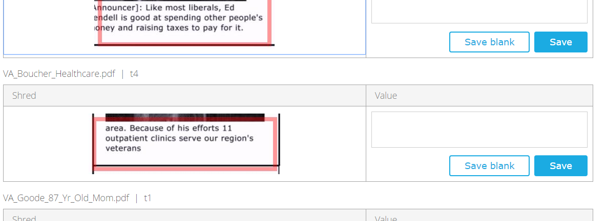

### captr: R Client for the Captricity API

OCR text and handwritten forms via [http://captricity.com/](http://captricity.com/).

#### Installation

To get the current development version from GitHub:


```r
install.packages("devtools")
devtools::install_github("soodoku/captr")
```

#### Load lib

```r
library(captr)
```

#### Using captr

Start by getting an application token and setting it using:


```r
# Not a real token
set_token("6dbee39a047c4de2b576b966")
```

Then, create a batch using:


```r
batch <- create_batch("wisc_ads")
batch$id
```

Next, upload image(s) to a batch

```r
path <- system.file("extdata/wisc_ads", package = "captr")
files <- dir(path, full.names = TRUE)
upimage <- lapply(files, upload_image, batch_id = batch$id)

names(upimage[[5]])
```

Once you have created a batch, you need to [go online](https://shreddr.captricity.com/job/) and create a template which tells Captricity what data to pull from where. (Captricity requires a template for each job and it appears that they can only be built online.) 

For instance, for this project, the template looked so:


Once you have a template, just go to inbox, and click on process batch and it will bring up potential templates. Pick the template you want and click ok.

Next, check whether the batch is ready to be processed:


```r
tester <- test_readiness(batch_id=batch$id)
tester$errors
```

You may also want to find out how much would processing the batch set you back by:


```r
price <- batch_price(batch_id=batch$id)
price$total_user_cost_in_cents
```

Next, submit the batch for processing. At this point, the batch changes to a **job**.

```r
submit <- submit_batch(batch_id=batch$id)
submit$related_job_id
```

To track progress of a job, use:

```r
progress <- track_progress(submit$related_job_id)
progress$percent_completed
```

List all forms (instance sets) associated with a job:

```r
list_instances <- list_instance_sets(job_id=submit$related_job_id)
list_instances$id
```

If you want to download data from a particular form, use the `list_instance_sets` to get the form (instance_set) id and run:

```r
res1 <- get_instance_set(instance_set_id=list_instances$id[1])
res1$best_estimate
```

Get csv of all your results from a job:

```r
get_all(job_id=submit$related_job_id)
```

Unfortunately, Captricity doesn't do a particularly good job at getting you the text. For instance, Captricity considers getting text from these fields as 'impossible':




You can check out the final [csv here](../inst/extdata/Wisc_Ads.csv).
